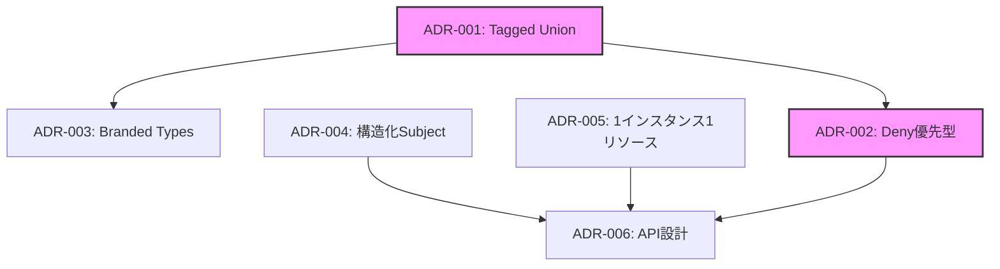

# ACL アーキテクチャ決定記録（ADR）一覧

このディレクトリには、ACL実装における重要な設計決定を文書化したADRが含まれています。

## ADR一覧

| ADR | タイトル | ステータス | 重要度 |
|-----|---------|-----------|---------|
| [001](./001-entry-type.md) | エントリー型の設計 - Tagged Union方式 | 承認 | ⭐⭐⭐ |
| [002](./002-evaluation-mode.md) | 評価方式 - Deny優先型 | 承認 | ⭐⭐⭐ |
| [003](./003-permission-patterns.md) | 権限パターンの型安全性 - Branded Types | 承認 | ⭐⭐ |
| [004](./004-subject-design.md) | 主体設計 - 構造化型とnameフィールド | 承認 | ⭐⭐ |
| [005](./005-resource-scope.md) | リソース範囲 - 1インスタンス1リソースと純粋なACL | 承認 | ⭐⭐ |
| [006](./006-api-design.md) | API設計 - 最小限の3メソッド | 承認 | ⭐⭐ |

## 各決定の要約

### 🎯 ADR-001: Tagged Union方式のエントリー型

**決定**: Allow/Denyエントリーを型レベルで区別するTagged Union方式を採用

**理由**: 
- 型安全性の確保
- 意図の明確化
- 実際の認可ライブラリ（AWS IAM等）でも採用

**影響**: コンパイル時にAllow/Denyの混同を防げる

---

### 🛡️ ADR-002: Deny優先型の評価方式

**決定**: すべてのエントリーを評価し、1つでもDenyがあれば拒否

**理由**:
- セキュリティファーストの原則
- エントリーの順序に依存しない
- Spring Security、AWS IAMと同じ動作

**影響**: 予測可能で安全なデフォルト動作

---

### 🔒 ADR-003: Branded Typesによる型安全性

**決定**: 許可用と拒否用の権限パターンを型レベルで区別

**理由**:
- 権限パターンの誤用を防止
- 実行時オーバーヘッドなし
- IDEの補完機能の向上

**影響**: DENY_PATTERNSをAllowエントリーで使用するとコンパイルエラー

---

### 👤 ADR-004: 構造化型とnameフィールド

**決定**: 主体を`{ type: 'user' | 'group', name: string }`で表現

**理由**:
- 型安全性と拡張性
- 学習時の可読性（nameが直感的）
- パース処理不要

**影響**: 将来的な主体タイプの追加が容易

---

### 📦 ADR-005: 1インスタンス1リソースと純粋なACL

**決定**: 
1. 1つのACLインスタンスが1つのリソースを管理
2. 所有者特権なしの純粋なACL

**理由**:
- 学習目的のシンプル化
- ACLの本質に集中
- Unix権限との明確な差別化

**影響**: コードが簡潔で理解しやすい

---

### 🔧 ADR-006: 最小限の3メソッドAPI

**決定**: `resolveAccess`、`addEntry`、`removeEntry`の3メソッドのみ

**理由**:
- ACLの本質的な機能に集中
- 学習時の認知負荷軽減
- メソッド名が処理内容を正確に表現

**影響**: 初学者が本質的な機能に集中できる

## 決定間の関連性

### 主要な設計の流れ

1. **型安全性の基盤**: Tagged Union（ADR-001）により、Allow/Denyを型レベルで区別
2. **セキュリティ原則**: Deny優先型（ADR-002）で安全なデフォルト動作を実現
3. **型安全性の強化**: Branded Types（ADR-003）で権限パターンの誤用を防止
4. **シンプルな設計**: 1インスタンス1リソース（ADR-005）と最小限API（ADR-006）で学習効果を最大化

## 採用した設計パターン

### 実際の認可ライブラリから学んだパターン

| パターン | 採用元の例 | ADR |
|----------|-----------|-----|
| Deny優先型 | Spring Security, AWS IAM, Casbin | ADR-002 |
| Tagged Union | TypeScript標準パターン | ADR-001 |
| Branded Types | 型安全ライブラリのベストプラクティス | ADR-003 |

## 学習の優先順位

初学者向けの推奨学習順序：

1. **最初に理解すべき**: ADR-001（Tagged Union）、ADR-002（Deny優先）
2. **次に理解すべき**: ADR-004（Subject設計）、ADR-006（API設計）
3. **応用的な理解**: ADR-003（Branded Types）、ADR-005（設計範囲）

## 今後の拡張可能性

これらのADRは、将来の拡張を妨げない設計となっています：

- **新しい主体タイプ**: ADR-004の構造化型により容易に追加可能
- **新しいエントリータイプ**: ADR-001のTagged Unionにより型安全に拡張可能
- **評価ロジックの変更**: ADR-002の評価方式は独立しているため変更可能

## 関連ドキュメント

- [ACL技術設計書](../design-doc.md) - より詳細な技術説明
- [実装例](../examples.md) - 具体的なコード例
- [ACL概要](../README.md) - 全体像の把握