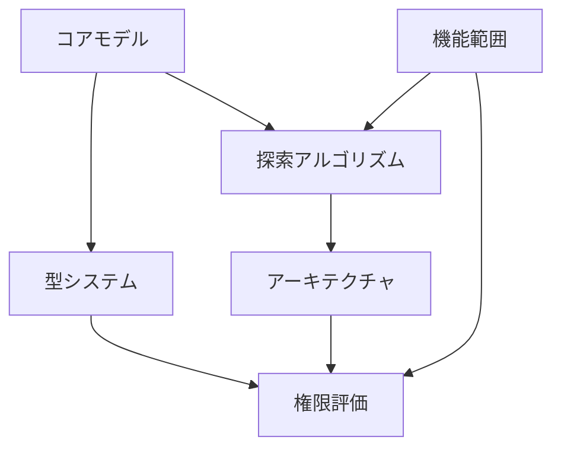

# ReBAC Architecture Decision Records (ADR)

このディレクトリには、ReBAC（Relationship-Based Access Control）実装における重要な設計決定を記録したADRが含まれています。

## ADR一覧

### [ADR-001: コアモデル - 関係性タプルとグラフ構造](./001-core-model.md)
- **決定**: オブジェクト形式のタプル、隣接リストによるグラフ実装
- **理由**: 型安全性、学習効果、実システムとの整合性
- **日付**: 2025-08-14

### [ADR-002: 探索アルゴリズム - BFSと深度制限](./002-traversal-algorithm.md)
- **決定**: BFS採用、設定可能な深度制限（デフォルト3）
- **理由**: 最短パスの保証、業界標準との一致
- **日付**: 2025-08-14

### [ADR-003: 型システム - 関係タイプの分離](./003-type-system.md)
- **決定**: EntityRelationType と ResourceRelationType の分離
- **理由**: 型安全性の向上、意味的な正確性
- **日付**: 2025-08-19

### [ADR-004: アーキテクチャ - クラス責任の分離](./004-architecture.md)
- **決定**: RelationshipExplorer と ReBACProtectedResource の分離
- **理由**: 単一責任の原則、テスタビリティ、拡張性
- **日付**: 2025-08-19

### [ADR-005: 権限評価 - ルールベース設計](./005-permission-evaluation.md)
- **決定**: PermissionRule インターフェースによるルール定義
- **理由**: 拡張性、自己文書化、柔軟性
- **日付**: 2025-08-14

### [ADR-006: 機能範囲 - Deny機能なし、基本機能のみ](./006-feature-scope.md)
- **決定**: Deny機能を実装しない（Zanzibar型）
- **理由**: 概念の純粋性、実装の単純性、業界標準準拠
- **日付**: 2025-08-14

## 決定間の関連性

## 主要な設計原則

1. **学習効果の最大化**: ReBACの核心概念を理解しやすい設計
2. **段階的な複雑性**: 基本から応用へ段階的に学習可能
3. **業界標準との整合性**: Google Zanzibar等の実システムに準拠
4. **型安全性**: TypeScriptの型システムを最大限活用
5. **単一責任の原則**: 各コンポーネントが明確な責任を持つ

## 今後の検討事項

- 否定的関係（Deny）の段階的導入
- キャッシュ戦略の実装
- 並列探索の最適化
- 条件付き関係の実装
- ABAC的な属性評価との組み合わせ